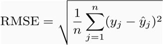

# Stock-price-prediction for APPLE

## I. DEFINE PROBLEM

* Machine learning and deep learning have been transforming finance and investement industry. AI powered trading could potentially reduce the risk and maximize returns. By accurately predicting stock prices, investors can maximize returns and can get an idea as to when they should buy or sell securities.
* So the goal of the project is to leverage a model to predict the future stock prices taking records of the previous 100 days stock price.
* The AI/ML model will be trained using a type of recurrent neural network(RNN)know as long short term memory networks(LSTM).
* Also the forecast of the next 30 days stock closing values is forecasted using our model.

**Environment or libraries used**

* Google Colab
* Python 3
* Numpy
* Pandas
* Sklearn
* Matplotlib
* Keras

**Datasets**

./data directory contains .csv files


## II. DISCOVER
**Exploratory Data analysis**

```python
# Function to plot interactive plots 
def interactive_plot(df, title):
  fig = px.line(title = title)
  for i in df.columns[1:]:
    fig.add_scatter(x = df['Date'], y = df[i], name = i)
  fig.show()

```


* The stock prices of all the companies are plotted using the interactive plot which helps to find exact stock price at a given month or year of the time.
* Analyzing the chart above it can be inferred that S&P 500 maintained the maximum stock price in the market and the S&P 500 stock price gradually increases with the time

**Normalization**

```
# Function to normalize stock prices based on their initial price
def normalize(df):
  x = df.copy()
  for i in x.columns[1:]:
    x[i] = x[i]/x[i][0]
  return x
```


* The normalised plot shown above gives us a really awesome knowledge about the consistency of stock prices. For an instance AAPL and S&P 500 enjoyed very consistent stock shares since a decade.
* On the other hand, one can clearly visualise the normalized stock price of companies like TESLA and which surged somewhere after 2014 and there value just became 50 times in 2020 with the invent of self driving cars and new technology.
* On the same note, Amazon sharply sparkled after 2018 when everyone wants to shop online and with the pandemic everyone wants to shop online making its market share value 18 times more.

**Focussing on Apple stock**
```
# Function to get the stock price of an individual company we are focusing on to do the stock price prediction
def individual_stock(price_df, name):
    return pd.DataFrame({'Date': price_df['Date'], 'Close': price_df[name]})
```


## III. DEVELOP
**Splitting the dataset of the Apple stock prices into 65% training and 35% testing data**

**Creating the trading data window**

```
# convert an array of values into a dataset matrix
import numpy as np

def create_dataset(dataset, time_step):
	dataX, dataY = [], []
	for i in range(len(dataset)-time_step-1):
		a = dataset[i:(i+time_step), 0]   ###i=0, 0,1,2,3-----99   100 
		dataX.append(a)
		dataY.append(dataset[i + time_step, 0])
	return np.array(dataX), np.array(dataY)

```

Create the dataset of train and test as per the time stamp of 100. So, for every 100 training sample there is one test sample received.

### CREATE LSTM MODEL TO PREDICT THE STOCK PRICES
### Create the Stacked LSTM model

Looking at the data set I decided to use Recurrent neural network specifically LSTM to train my model.
```
from tensorflow.keras.models import Sequential
from tensorflow.keras.layers import Dense
from tensorflow.keras.layers import LSTM
from tensorflow.keras.layers import Dense, Embedding, LSTM, Dropout, Flatten
model=Sequential()
model.add(LSTM(50,return_sequences=True,input_shape=(100,1)))
model.add(LSTM(50,return_sequences=True))
model.add(LSTM(50))
model.add(Dense(1))
model.compile(loss='mean_squared_error',optimizer='adam')
```
 
**Metrics**

To determine how accurate the prediction is, we analyze the difference between the predicted and the actual adjusted close price. Smaller the difference indicates better accuracy.

I chose both Mean Squared Error (MSE) and Root Mean Squared Error (RMSE) as a metric to determine the accuracy of the prediction. It is a commonly used general purpose quality estimator.

Also, by visualizing the predicted price and the actual price with a plot or a graph, it can tell how close the prediction is clearly.

**Why I use MSE/RMSE for the metric?**

There are many metrics for accuracy like R2, MAE, etc.

I chose to use MSE/RMSE because they explicitly show the deviation of the prediction for continuous variables from the actual dataset. So, they fit in this project to measure the accuracy.




It measures the average magnitude of the error and ranges from 0 to infinity. The errors are squared and then they are averaged, MSE/RMSE gives a relatively high weight to large errors, and the errors in stock price prediction can be critical, so it is appropriate metric to penalize the large errors. 

**The RMSE of test predict is 237**

## **ACTUAL VERSUS PREDICTED STOCK PRICES OF THE APPLE STOCK MARKET**


* The blue graph indicates the actual data
* The orange indicates the train predict
* The green indicates the test predict

# PREDICT FUTURE 30 DAYS STOCK PRICE

After the 2059th stock price of Apple, new stock price for 30 days was predicted which can be shown in the graph below.

```
# demonstrate prediction for next 30 days
from numpy import array

lst_output=[]
n_steps=100
i=0
while(i<30):
    
    if(len(temp_input)>100):
        x_input=np.array(temp_input[1:])
        #print("{} day input {}".format(i,x_input))
        x_input=x_input.reshape(1,-1)
        x_input = x_input.reshape((1, n_steps, 1))
        yhat = model.predict(x_input, verbose=0)
        print("{} day output {}".format(i,yhat))
        temp_input.extend(yhat[0].tolist())
        temp_input=temp_input[1:]
        lst_output.extend(yhat.tolist())
        i=i+1
    else:
        x_input = x_input.reshape((1, n_steps,1))
        yhat = model.predict(x_input, verbose=0)
        print(yhat[0])
        temp_input.extend(yhat[0].tolist())
        (len(temp_input))
        lst_output.extend(yhat.tolist())
        i=i+1

print(lst_output)
```

```
# Prediction of future 30 days stock price data
import matplotlib.pyplot as plt

plt.plot(day_new,df_apple[2059:])
plt.plot(day_pred,scaler.inverse_transform(lst_output))
```


* The orange line shows the future 30 days forecast of Apple stock price
